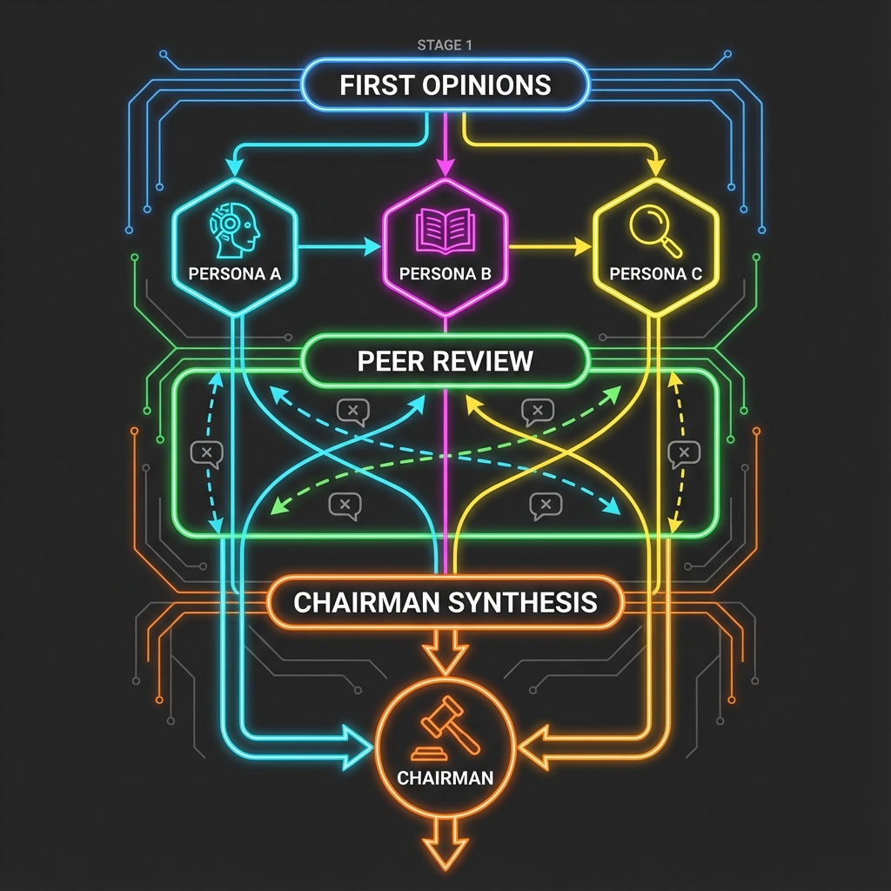
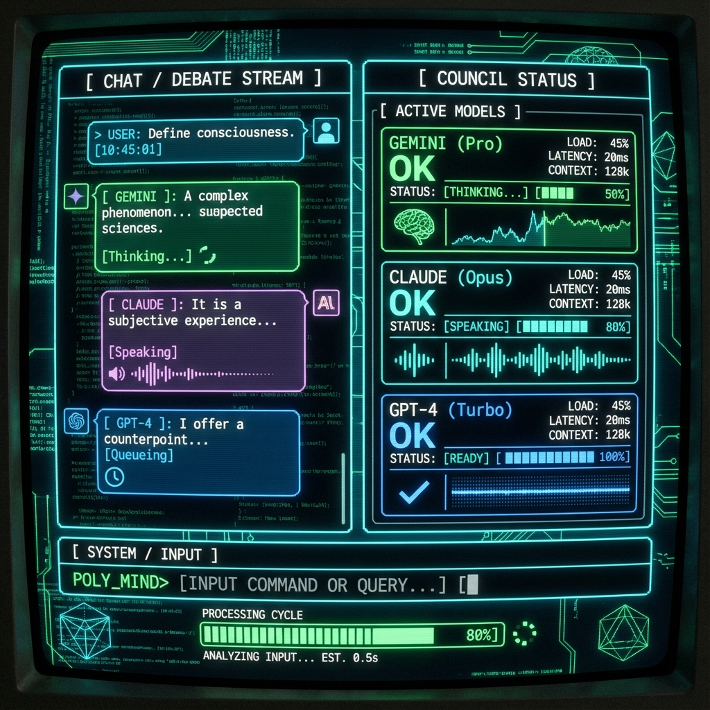
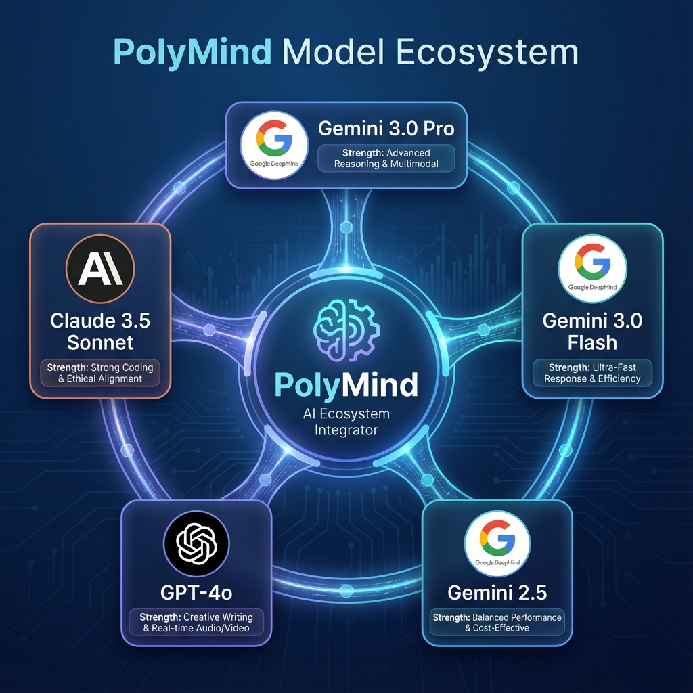
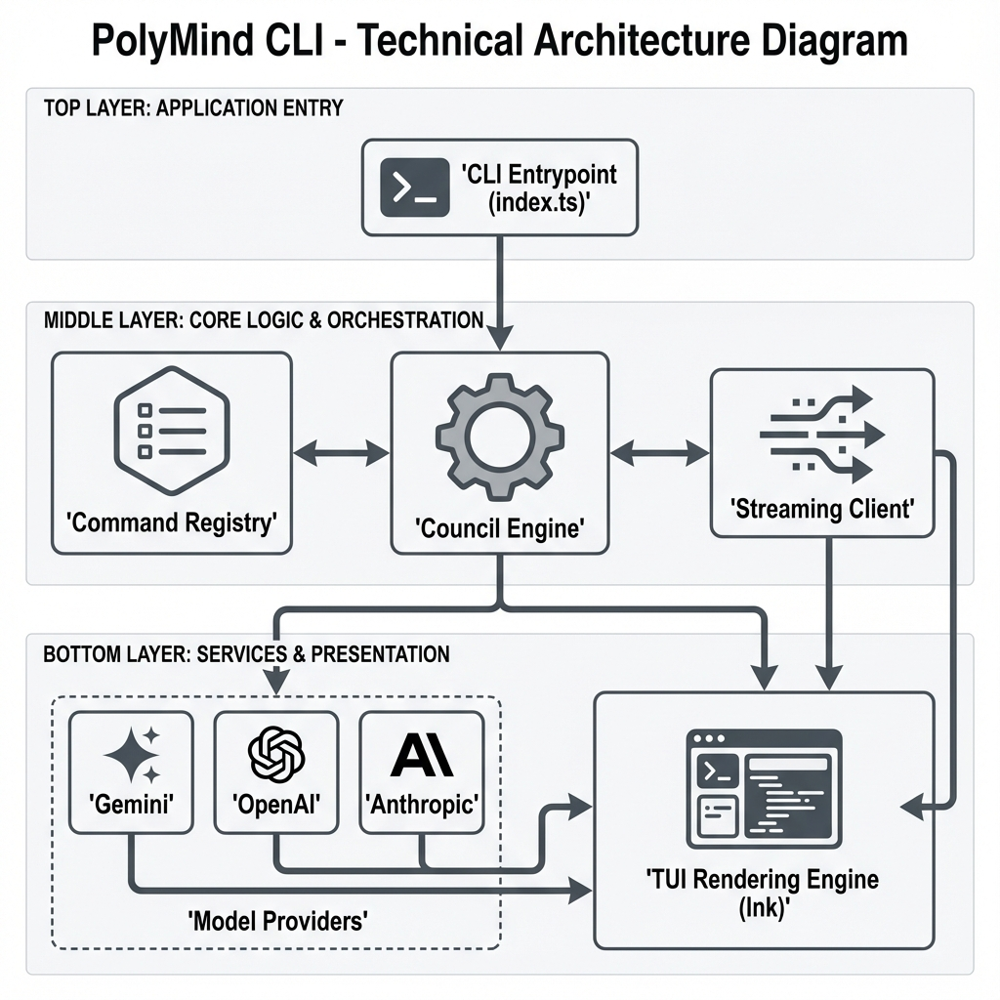

# PolyMind CLI

> **Multi-Model AI Council & Agentic Workflows in Your Terminal**

[](https://www.npmjs.com/package/polymind-cli)
[](https://opensource.org/licenses/MIT)
[](https://www.typescriptlang.org/)

**PolyMind CLI** is a next-generation terminal interface designed for developers who want to leverage the power of **LLM Councils**. Instead of relying on a single model, PolyMind orchestrates a debate between multiple AI personas (powered by Gemini 3.0, GPT-4o, Claude 3.5) to reach higher-quality conclusions through dialectic reasoning.

## ⚡ The Origin Story: 99% Vibecoded

The idea for PolyMind didn't come from a whiteboard session or a product roadmap. It surfaced in a flash of inspiration—a desire to see what would happen if you put the world's smartest AIs in a room (or a server) and forced them to agree.

This entire project was **99% vibecoded**. It wasn't about rigid engineering specs; it was about capturing a feeling. The feeling of a futuristic council chamber, the matrix-like flow of data, and the raw power of dialectic reasoning in your terminal. We built this to look cool, feel premium, and actually work.

Built with **Node.js**, **TypeScript**, and **Ink**, it delivers a premium, interactive TUI (Terminal User Interface) experience.

---

## 🚀 Features

- **🤖 Multi-Model Council**: Orchestrate debates between different AI personas to reduce hallucination and improve reasoning.
- **⚡ Real-time Streaming**: Watch the debate unfold character-by-character with a matrix-style TUI.
- **🧠 Advanced Reasoning**: Implements a 3-stage council workflow (Proposal -> Rebuttal -> Consensus).
- **🔌 Multi-Provider Support**: First-class support for **Gemini 3.0**, **GPT-4o**, and **Claude 3.5**.
- **🎨 Interactive TUI**: Beautiful, responsive terminal interface with animations, progress bars, and syntax highlighting.
- **🛠️ Extensible Config**: Easy-to-use configuration for API keys, personas, and debate parameters.

---

## 📦 Installation

Ensure you have **Node.js 18+** installed.

```bash
# Install globally via npm
npm install -g polymind-cli

# Or run directly with npx
npx polymind-cli debate "Is Rust better than C++?"
```

---

## 🛠️ Configuration

Before running your first council, initialize the configuration with your API keys.

```bash
polymind init
```

You can also configure providers manually:

```bash
# Set Gemini as the default provider
polymind config set provider gemini

# Add your API key
polymind config set apiKey AIzaSy...
```

### Supported Environment Variables

Create a `.env` file or export these variables:

| Variable            | Description                                  |
| ------------------- | -------------------------------------------- |
| `GEMINI_API_KEY`    | Key for Google Gemini models                 |
| `OPENAI_API_KEY`    | Key for OpenAI GPT models                    |
| `CLAUDE_API_KEY`    | Key for Anthropic Claude models              |
| `POLYMIND_PROVIDER` | Default provider (`gemini`, `gpt`, `claude`) |

---

## 🧠 The LLM Council Engine

PolyMind uses a sophisticated **Council Engine** to elevate AI reasoning. Unlike standard chat, a Council Session involves multiple stages of deliberation.



### Stage 1: First Opinions (Proposal)

Independent personas (e.g., "The Skeptic", "The Visionary", "The Engineer") analyze the user's query in parallel. They generate initial stances without being influenced by each other.

### Stage 2: Peer Review (Rebuttal)

The engine shuffles the proposals and has each persona critique another's viewpoint. This "adversarial" phase exposes flaws, biases, and weak arguments.

### Stage 3: Chairman Synthesis (Consensus)

A designated "Chairman" model (typically the most capable model, e.g., Gemini 3.0 Pro) synthesizes the proposals and rebuttals into a final, comprehensive answer.

---

## 💻 Usage

### 1. Start a Debate

The core feature of PolyMind. Ask a complex question and watch the council deliberate.

```bash
polymind debate "Should we rewrite our legacy monolith in Microservices?" \
  --rounds 3 \
  --personas "Architect" "ProductManager" "DevOps"
```

### 2. Interactive Chat

Chat one-on-one with a specific persona in a persistent session.

```bash
polymind chat --persona "Senior Engineer"
```

### 3. Interactive Mode (Slash Commands)

Enter a shell-like environment to run multiple commands.

```bash
polymind interactive
# Then type: /debate "AI Safety"
```

---

## 🖥️ TUI Overview

PolyMind features a rich **Terminal User Interface** built with React and Ink.



- **Split Views**: Monitor the debate stream and council status simultaneously.
- **Status Indicators**: See which model is "Thinking", "Drafting", or "Reviewing".
- **Rich Text**: Markdown rendering, code syntax highlighting, and emoji support.

---

## 🤖 Supported Models

PolyMind is optimized for the latest generation of reasoning models.



| Model                 | Type           | Best For                             |
| --------------------- | -------------- | ------------------------------------ |
| **Gemini 3.0 Pro**    | Multimodal     | **Chairman Role**, Complex Synthesis |
| **Gemini 3.0 Flash**  | Fast Inference | Initial Proposals, Quick Rebuttals   |
| **GPT-4o**            | Reasoning      | Logic Checks, Code Verification      |
| **Claude 3.5 Sonnet** | Creative       | Nuanced Arguments, Ethical Review    |

---

## 🏗️ Architecture

PolyMind is built on a modular architecture designed for extensibility.



- **CLI Entrypoint**: Handles argument parsing and command dispatch (`commander`).
- **Command Registry**: Maps commands (`debate`, `chat`) to their handlers.
- **Council Engine**: (Simulation Mode in v1.0) Orchestrates the multi-stage debate flow.
- **TUI Layer**: Renders the state to the terminal using `ink` and `react`.
- **Provider Abstraction**: Unified interface for calling different LLM APIs.

---

## 🗺️ Roadmap

- [x] **v1.0.0**: Initial Release with TUI and Simulated Council.
- [ ] **v1.1.0**: Real-time API integration for all providers.
- [ ] **v1.2.0**: Custom Persona definitions via YAML.
- [ ] **v2.0.0**: Local LLM support via Ollama integration.

---

## 🤝 Contributing

We welcome contributions! Please see [CONTRIBUTING.md](CONTRIBUTING.md) for details.

1. Fork the repo
2. Create your feature branch (`git checkout -b feature/amazing-feature`)
3. Commit your changes (`git commit -m 'Add some amazing feature'`)
4. Push to the branch (`git push origin feature/amazing-feature`)
5. Open a Pull Request

---

## 📄 License

Distributed under the MIT License. See `LICENSE` for more information.
